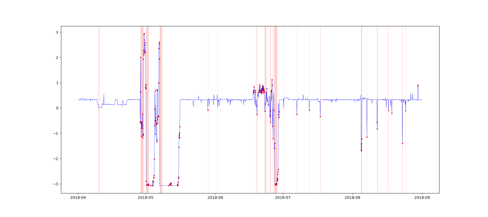

# Pump Sensor Anomaly Detection

This project aims to detect anomalies in pump sensor data to prevent potential failures and maintain operational efficiency. By leveraging machine learning algorithms, the project identifies unusual patterns that indicate a deviation from the normal operational parameters.

#### -- Project Status: [Complete]

---

## Project Objective

The primary goal is to apply anomaly detection techniques to pump sensor data to identify potential issues before they lead to significant problems. Using a combination of isolation forests and level shift detection algorithms, the project offers a way to monitor pump performance and detect early signs of malfunction.

## Raw Data

The dataset used in this project comprises sensor readings from various pumps, including metrics like temperature, pressure, vibration, and flow rates.

**Source:** [Kaggle - Pump Sensor Data](https://www.kaggle.com/datasets/nphantawee/pump-sensor-data)

## Technologies

* Python
* PyTorch
* Pandas
* Numpy
* scikit-learn
* ruptures
* ADTK

## Methodologies

- **Data Preprocessing:** Cleaning and preparing the sensor data for analysis.
- **Anomaly Detection:** Implementing the Isolation Forest algorithm from scikit-learn and level shift detection using the `ruptures` and `ADTK` libraries. This approach allows for the early identification of potential anomalies in the sensor data.
- **Evaluation:** Assessing the effectiveness of the chosen algorithms in detecting anomalies and comparing their performance.

---

## Contacts

For any inquiries or further discussion regarding this project, feel free to reach out.

Email: delstonds@outlook.com
